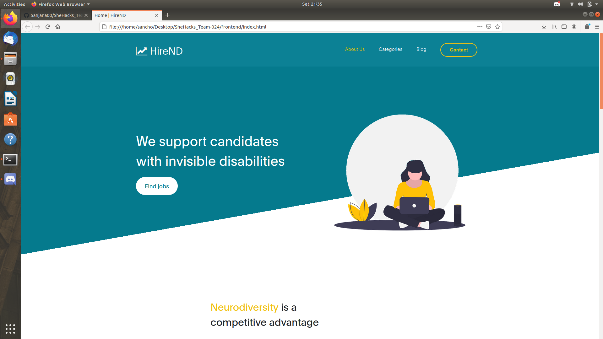
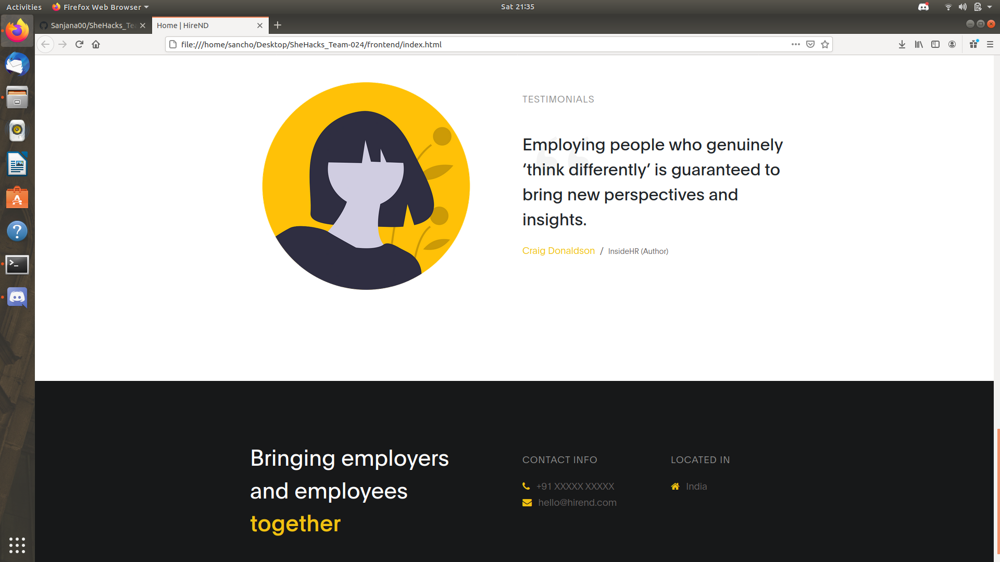

# SheHacks Team-024 Catch_42

## HireND

> Neurodiversity is a competitive advantage

HireND is a job portal aimed at connecting employers to employees through neurodivergent hiring initiatives. This project aims at providing a level playing field to individuals with autism spectrum disorder, ADHD, dyslexia or other such hidden disabilities.

Since the usual interview and selection processes place neurodivergent individuals at an obvious disadvantage, the industry needs to adapt to more inclusive hiring practices. Observation has shown that having more neurodivergent people in the workforce resulted in boosted productivity, greater attention to detail, rise in innovation and an overall healthier and more inclusive work environment. It also led to managers paying greater attention to employee satisfaction.

With an anticipated rise in inclusive hiring techniques, a more structured approach was needed. Therefore, HireND came into being. We hope that each and every individual, irrespective of their differences, is able to showcase their skills and unlock their full potential.

### Members:

- [Sanjana Chakravarty](https://github.com/Sanjana00)
- [Sonal Kushwaha](https://github.com/sonalsk)
- [Sanandita Das](https://github.com/sanandita001)
- [Aishwarya Deb](https://github.com/Chibi-girl)

Website template: [here](https://www.free-css.com/free-css-templates/page263/digital-trend)
